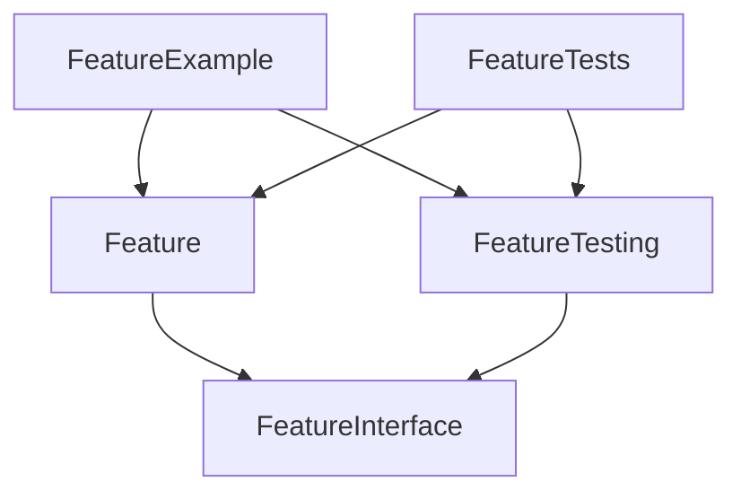
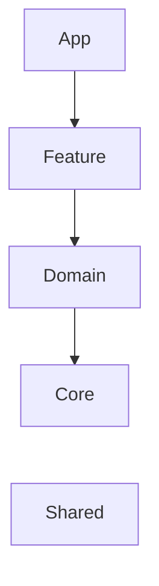

# GoogleBookSearch
구글 API를 통해 책 검색 하는 서비스

# 목표
- 구글 검색 API를 통해 책 목록을 검색합니다.
- 목록과 상세페이지로 구성합니다.
- 참고 API
  - https://developers.google.com/books/docs/v1/using?hl=en#PerformingSearch

# Branch Rule
### Trunk Based Development
- Trunk Based Developement(TBD)([링크](https://trunkbaseddevelopment.com/trunk1c.png))를 채택합니다.

# 아키텍처
### Clean Architecture

- Presentation -> Domain <- Data 형태를 사용합니다. [(링크)](https://bitloops.com/docs/bitloops-language/learning/software-architecture/clean-architecture)

추가 설명

- 
  - 도메인 모듈
  - Input / Output protocol

- 
- 클린아키텍처 그림 34.8
  - Layer 방식
  - 가장 마지막 방식을 사용합니다.
  - App -> Feature(Controller) -> Domain (Domain + Data) -> Core

### TMA
- The Modular Architecture (TMA)[(링크)](https://docs.tuist.dev/en/guides/develop/projects/tma-architecture)를 지향합니다.

### Layer

# CI/CD
### CI(Continuous Integration)
- 지속적 통합을 위해 보기용 작업이 돌아갑니다.
- TBD방식을 채택해 Trunk로 들어가기 위한 PR생성시 빌드+테스트가 실행됩니다.
  - Tuist 기반 build + test를 실행합니다.
  - 관련 작성한 블로그 [보러가기](https://medium.com/@talq44/github-action%EA%B3%BC-self-hosted-runner%EB%A1%9C-ios-build-test%EB%A5%BC-%EB%8F%8C%EB%A6%AC%EB%8A%94-%EA%B1%B0%EA%B8%B0%EC%97%90-tuist%EB%A5%BC-%EA%B3%81%EB%93%A4%EC%9D%B8-ea4af8ace455)

